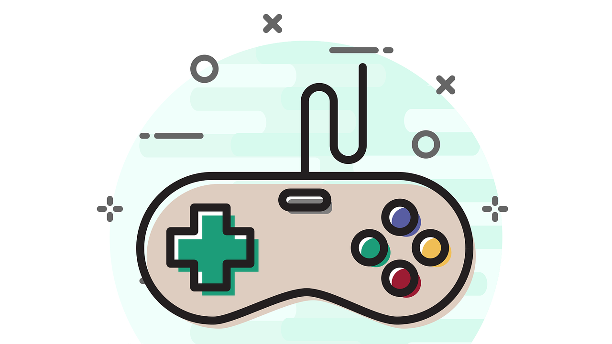

# games

## what does it do

## what is it

## technology used

## ambition of project

## stage

## known issues / thing not properly done 

## Table of Content
- quick start
- status
- what's included
- bug and feature request
- running documentation locally
- pervious releases
- contributing
- community 
- versioning
- creators
- thanks
- backers/sponsors
- copyright and license

## quick start
Get started by creating a new file or uploading an existing file. We recommend every repository include a README, LICENSE, and .gitignore.
…or create a new repository on the command line

<pre>
echo "# games" >> README.md
git init
git add README.md
git commit -m "first commit"
git remote add origin https://github.com/keeyanajones/games.git
git push -u origin master
</pre>                

…or push an existing repository from the command line

<pre>
git remote add origin https://github.com/keeyanajones/games.git
git push -u origin master
</pre>

…or import code from another repository

You can initialize this repository with code from a Subversion, Mercurial, or TFS project.
ProTip! Use the URL for this page when adding GitHub as a remote. 

## status

## what's included

## Installation
    
## Usage
    
## bug and feature request

## running documentation locally

## previous releases

## contributing

## community
 
## versioning

## creators

## thanks/backers/sponsors
 
## copyright and license 
 
